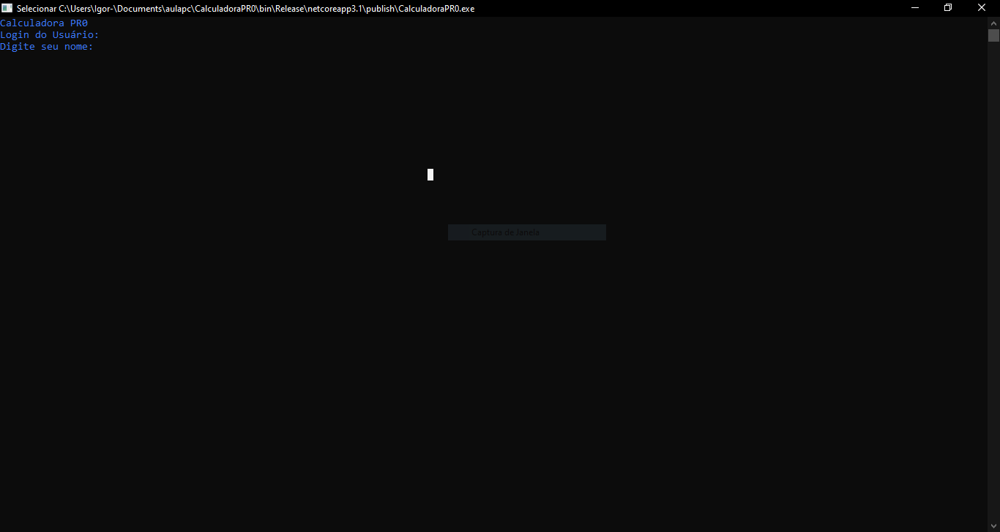

# CalculadoraPR0
Este software é uma Calculadora com 6 Ultilidade Em Dev C#. 


## Exemplo

```
Calculadora PR0
Login do Usuário:
Digite seu nome: IGOR

Sucesso IGOR
Enter para continuar

Adição
Subtração
Multiplicação
Divisão
Potencia
Raiz

Igor Digite uma das operações da lista:
```
## _Screenshot_


## _Download_

Baixe o arquivo abaixo. Descompacte na pasta desejada.

[✔ Download do Arquivo .zip](dist/CalculadoraPR0.zip)

Execute ultilizando o comando:

```
dotnet  CalculadoraPR0.dll
```

Ou, se estiver no Windows, pode dar um duplo-clique no icone do programa

## Agradecimentos

* [Etec Adolpho Berezin](http://eteab.com.br/) 
* [Prof. Ermogenes](https://github.com/ermogenes)
* [Prof. Diego Neri](https://github.com/diegoneri)
* [Dev C#](https://github.com/ermogenes/aulas-programacao-csharp)

---
Todos os direitos reservados!(https://github.com/IgorPR0/CalculadoraPR0) Mongaguá * 2020 

